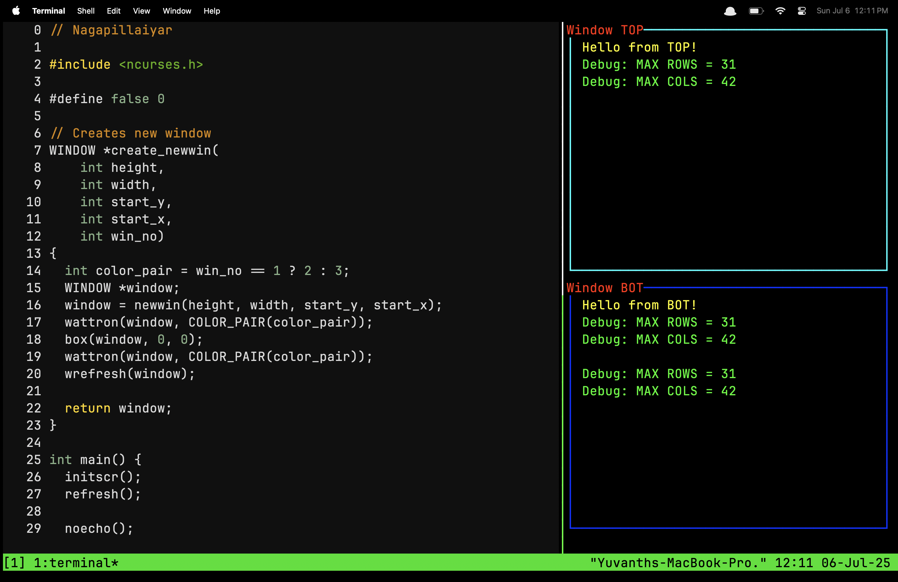

# === LIB ===
Small libraries for exploring C.

# === NCURSES.H ===
File: main.c

Image: assets/ncurses.png

Explored and made vertical splits in the terminal with windows.

For (original) text version, go to readme.txt.
